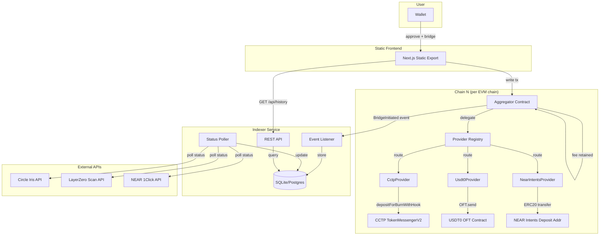
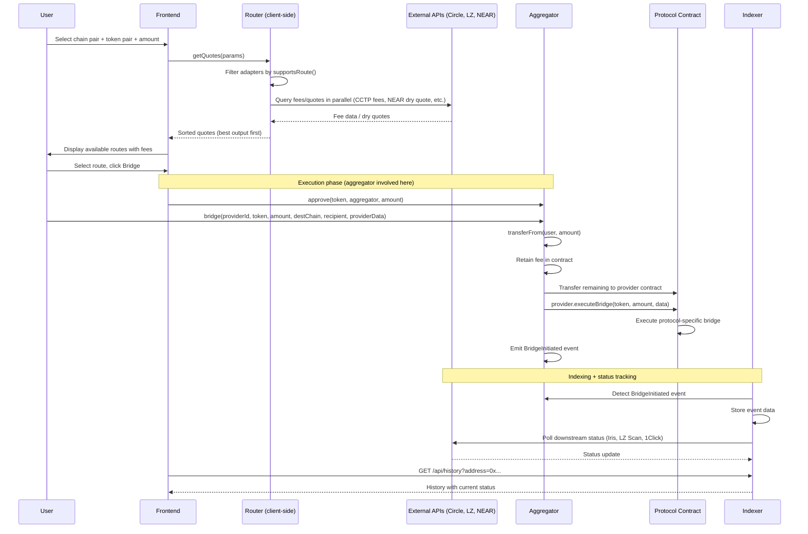

# Design Document: Aggregator Contract Bridge Architecture (v2)

## Overview

QoreBridge v2 replaces the server-backed architecture with three decoupled components:

1. **Aggregator Smart Contract** — A Solidity contract deployed per EVM chain. All bridge transactions flow through a single `bridge()` function. It collects platform fees (retained in-contract, swept by owner), emits `BridgeInitiated` events, and delegates to registered Bridge Provider contracts. A provider registry allows adding new bridge protocols without redeploying the aggregator.

2. **Bridge Provider Contracts** — Small Solidity contracts (one per protocol) implementing the `IBridgeProvider` interface. Each handles the protocol-specific logic: `CctpProvider` calls TokenMessengerV2, `Usdt0Provider` calls OFT.send(), `NearIntentsProvider` transfers to a deposit address. Providers manage their own approvals to protocol contracts.

2. **Indexer Service** — A lightweight Node.js service that listens to `BridgeInitiated` events across all chains, polls downstream status APIs (Circle Iris, LayerZero Scan, NEAR 1Click), and exposes a read-only REST API for bridge history.

3. **Static Frontend** — The existing Next.js app converted to a pure static export. It calls the Aggregator Contract instead of protocols directly, reads history from the Indexer API, and has zero server-side dependencies.

### Key Design Decisions

- **Fee accumulation over per-tx transfer**: Fees stay in the contract and are swept by the owner. Saves ~35k gas per tx vs transferring to treasury on each call.
- **Provider registry pattern**: Each bridge protocol is a separate provider contract registered in the aggregator. New protocols can be added without redeploying the aggregator. Standard pattern used by 1inch, LI.FI, Socket.
- **Provider-managed approvals**: Each provider contract grants max approval to its protocol during initialization. The aggregator doesn't need to know about protocol-specific approval logic.
- **Foundry for contract development**: Chosen over Hardhat for faster compilation, built-in fuzzing, and Solidity-native testing.
- **Separate indexer service**: Decoupled from the frontend so the frontend remains fully static. The indexer can be rebuilt from on-chain events at any time.

## Architecture



### Bridge Transaction Flow



## Components and Interfaces

### 1. Aggregator Smart Contract (Solidity)

```solidity
// SPDX-License-Identifier: MIT
pragma solidity ^0.8.20;

interface IBridgeProvider {
    /// @notice Execute the bridge call. Tokens have already been transferred to this contract.
    /// @param token The token being bridged
    /// @param amount The amount after fee deduction
    /// @param data Provider-specific calldata
    function executeBridge(
        address token,
        uint256 amount,
        bytes calldata data
    ) external payable;
}

interface IQoreBridgeAggregator {
    // Events
    event BridgeInitiated(
        uint256 indexed nonce,
        address indexed sender,
        bytes32 recipient,
        uint256 sourceChainId,
        uint256 destinationChainId,
        address token,
        uint256 amount,
        uint256 platformFee,
        bytes32 providerId,
        bytes providerData
    );

    event FeesSwept(address indexed token, address indexed treasury, uint256 amount);
    event ProviderRegistered(bytes32 indexed providerId, address providerContract);
    event ProviderDisabled(bytes32 indexed providerId);
    event ProviderEnabled(bytes32 indexed providerId);

    // Generic bridge entry point
    function bridge(
        bytes32 providerId,
        address token,
        uint256 amount,
        uint256 destinationChainId,
        bytes32 recipient,
        bytes calldata providerData
    ) external payable;

    // Provider registry (immutable ID → address mapping)
    function registerProvider(bytes32 providerId, address providerContract) external;
    function disableProvider(bytes32 providerId) external;
    function enableProvider(bytes32 providerId) external;
    function getProvider(bytes32 providerId) external view returns (address);
    function isProviderEnabled(bytes32 providerId) external view returns (bool);

    // Admin functions
    function setFeeBps(uint16 newFeeBps) external;
    function setTreasury(address newTreasury) external;
    function sweepFees(address token) external;
    function pause() external;
    function unpause() external;

    // View functions
    function feeBps() external view returns (uint16);
    function treasury() external view returns (address);
    function nonce() external view returns (uint256);
}
```

**Key implementation details:**
- Inherits `Ownable`, `ReentrancyGuard`, `Pausable` from OpenZeppelin
- Constructor takes: owner, treasury, feeBps
- `bridge()`: uses `SafeERC20.safeTransferFrom` to pull tokens from user, retains fee, transfers remaining to provider contract, calls `provider.executeBridge{value: msg.value}`, increments nonce, emits `BridgeInitiated`. Reverts if provider is not registered or is disabled.
- `registerProvider()`: stores provider address and sets enabled = true. Reverts with `ProviderAlreadyRegistered` if the ID is already registered. Once registered, the ID-to-address mapping is immutable and can never be changed or deleted.
- `disableProvider()` / `enableProvider()`: toggles the enabled flag for a registered provider without modifying the address mapping.
- Provider identifier is `bytes32` (e.g., `keccak256("cctp")`, `keccak256("usdt0")`, `keccak256("near-intents")`). To replace a provider, register a new ID (e.g., `keccak256("cctp-v2")`) and disable the old one.

### 1a. CCTP Provider Contract

```solidity
contract CctpProvider is IBridgeProvider {
    address public immutable tokenMessengerV2;
    address public immutable usdc;

    constructor(address _tokenMessengerV2, address _usdc) {
        tokenMessengerV2 = _tokenMessengerV2;
        usdc = _usdc;
        // One-time max approval to CCTP
        IERC20(_usdc).approve(_tokenMessengerV2, type(uint256).max);
    }

    function executeBridge(address token, uint256 amount, bytes calldata data) external payable {
        require(token == usdc, "CctpProvider: only USDC");
        (uint32 destDomain, bytes32 mintRecipient, uint256 maxFee,
         uint32 minFinalityThreshold, bytes memory hookData) = abi.decode(
            data, (uint32, bytes32, uint256, uint32, bytes)
        );
        ITokenMessengerV2(tokenMessengerV2).depositForBurnWithHook(
            amount, destDomain, mintRecipient, token,
            bytes32(0), maxFee, minFinalityThreshold, hookData
        );
    }
}
```

### 1b. USDT0 Provider Contract

```solidity
contract Usdt0Provider is IBridgeProvider {
    address public immutable oftContract;

    constructor(address _oftContract) {
        oftContract = _oftContract;
    }

    function executeBridge(address token, uint256 amount, bytes calldata data) external payable {
        (uint32 dstEid, bytes32 recipient, uint256 minAmountLD,
         bytes memory extraOptions, bytes memory composeMsg, bytes memory oftCmd) = abi.decode(
            data, (uint32, bytes32, uint256, bytes, bytes, bytes)
        );
        IOFT.SendParam memory sendParam = IOFT.SendParam({
            dstEid: dstEid, to: recipient, amountLD: amount,
            minAmountLD: minAmountLD, extraOptions: extraOptions,
            composeMsg: composeMsg, oftCmd: oftCmd
        });
        // Quote the LZ fee and forward msg.value
        IOFT(oftContract).send{value: msg.value}(sendParam,
            IOFT.MessagingFee({nativeFee: msg.value, lzTokenFee: 0}), msg.sender);
    }
}
```

### 1c. NEAR Intents Provider Contract

```solidity
contract NearIntentsProvider is IBridgeProvider {
    function executeBridge(address token, uint256 amount, bytes calldata data) external payable {
        (address depositAddress) = abi.decode(data, (address));
        require(depositAddress != address(0), "NearIntentsProvider: zero deposit address");
        IERC20(token).safeTransfer(depositAddress, amount);
    }
}
```

### 2. Indexer Service (Node.js/TypeScript)

```typescript
// Core interfaces for the indexer service

interface IndexedBridgeEvent {
  nonce: number;
  txHash: string;
  blockNumber: number;
  timestamp: number;
  chainId: number;
  sender: string;
  recipient: string;       // bytes32 hex
  sourceChainId: number;
  destinationChainId: number;
  token: string;
  amount: string;          // bigint as string
  platformFee: string;     // bigint as string
  provider: "cctp" | "usdt0" | "near-intents";
  providerData: string;    // hex-encoded
  // Status tracking
  status: "pending" | "done" | "failed";
  destinationTxHash?: string;
  failureMessage?: string;
  lastPolledAt?: number;
}

interface IndexerConfig {
  chains: {
    chainId: number;
    rpcUrl: string;
    aggregatorAddress: string;
    startBlock: number;
  }[];
  pollIntervalMs: number;       // default 10000
  statusPollIntervalMs: number; // default 10000
}
```

**Components:**
- **EventListener**: Uses `ethers.js` or `viem` to subscribe to `BridgeInitiated` logs on each chain. Persists last processed block per chain for crash recovery.
- **StatusPoller**: Iterates pending transactions, calls the appropriate downstream API based on provider, updates status.
- **REST API**: Express.js or Hono server with endpoints:
  - `GET /api/history?address={addr}&limit={n}&offset={n}` — list by wallet
  - `GET /api/history/{txHash}` — single entry by tx hash
  - CORS enabled for all origins

### 3. Frontend Changes

**Files to modify:**
- `src/hooks/useBridgeTransaction.ts` — Call `aggregator.bridge(providerId, ...)` instead of protocol-specific functions
- `src/hooks/useBridgeHistory.ts` — Fetch from indexer REST API instead of `/api/history`
- `src/services/router.ts` — `getApprovalAddress` returns aggregator address per chain
- `src/config/contracts.ts` — Add aggregator contract addresses per chain, add provider ID constants
- `src/abi/` — Add aggregator ABI

**Files to remove:**
- `src/app/api/` — All server-side API routes
- `src/lib/db.ts` — PostgreSQL connection
- `scripts/init-db.sql` — DB schema

**Config changes:**
- `next.config.ts` — Add `output: "export"` for static generation
- `package.json` — Remove `pg` dependency
- `docker-compose.yml` — Remove `db` service, simplify to indexer only

### 4. Deployment Scripts (Foundry)

```
contracts/
├── src/
│   ├── QoreBridgeAggregator.sol
│   ├── interfaces/
│   │   └── IBridgeProvider.sol
│   └── providers/
│       ├── CctpProvider.sol
│       ├── Usdt0Provider.sol
│       └── NearIntentsProvider.sol
├── test/
│   ├── QoreBridgeAggregator.t.sol
│   └── mocks/
│       ├── MockERC20.sol
│       ├── MockTokenMessengerV2.sol
│       └── MockOFT.sol
├── script/
│   └── Deploy.s.sol
├── foundry.toml
└── remappings.txt
```

The deploy script deploys the aggregator, deploys each provider contract with chain-specific protocol addresses, and registers providers in the aggregator.

## Data Models

### On-Chain: BridgeInitiated Event

| Field | Type | Description |
|-------|------|-------------|
| nonce | uint256 (indexed) | Monotonically increasing per-contract counter |
| sender | address (indexed) | User's wallet address |
| recipient | bytes32 | Destination address (padded to 32 bytes for cross-chain compat) |
| sourceChainId | uint256 | EVM chain ID of the source chain |
| destinationChainId | uint256 | Target chain identifier (EVM chain ID, CCTP domain, or LZ endpoint ID depending on provider) |
| token | address | Source token contract address |
| amount | uint256 | Total input amount (before fee deduction) |
| platformFee | uint256 | Fee amount retained by the contract |
| provider | bytes32 | Bridge provider identifier hash: keccak256("cctp"), keccak256("usdt0"), or keccak256("near-intents") |
| providerData | bytes | ABI-encoded provider-specific data |

### Provider Data Encoding

**CCTP providerData:**
```solidity
abi.encode(uint32 destinationDomain, uint256 maxFee, uint32 minFinalityThreshold)
```

**USDT0 providerData:**
```solidity
abi.encode(uint32 dstEid, uint256 nativeFee)
```

**NEAR Intents providerData:**
```solidity
abi.encode(address depositAddress)
```

### Indexer Database Schema

```sql
CREATE TABLE bridge_events (
  id INTEGER PRIMARY KEY AUTOINCREMENT,
  nonce INTEGER NOT NULL,
  tx_hash TEXT NOT NULL UNIQUE,
  block_number INTEGER NOT NULL,
  timestamp INTEGER NOT NULL,
  chain_id INTEGER NOT NULL,
  sender TEXT NOT NULL,
  recipient TEXT NOT NULL,
  source_chain_id INTEGER NOT NULL,
  destination_chain_id INTEGER NOT NULL,
  token TEXT NOT NULL,
  amount TEXT NOT NULL,
  platform_fee TEXT NOT NULL,
  provider TEXT NOT NULL,
  provider_data TEXT NOT NULL,
  status TEXT NOT NULL DEFAULT 'pending',
  destination_tx_hash TEXT,
  failure_message TEXT,
  last_polled_at INTEGER
);

CREATE INDEX idx_bridge_events_sender ON bridge_events(sender);
CREATE INDEX idx_bridge_events_status ON bridge_events(status);
CREATE INDEX idx_bridge_events_timestamp ON bridge_events(timestamp DESC);

CREATE TABLE indexer_state (
  chain_id INTEGER PRIMARY KEY,
  last_block_number INTEGER NOT NULL
);
```

### Frontend Configuration: Aggregator Addresses

```typescript
// src/config/contracts.ts — new additions
export const AGGREGATOR_CONTRACTS: Record<number, `0x${string}`> = {
  [mainnet.id]: "0x...",   // deployed address
  [arbitrum.id]: "0x...",
  [base.id]: "0x...",
  [optimism.id]: "0x...",
  [polygon.id]: "0x...",
  [avalanche.id]: "0x...",
};

// Provider IDs (keccak256 hashes of provider names, matching on-chain registry)
export const PROVIDER_IDS = {
  cctp: "0x..." as `0x${string}`,       // keccak256("cctp")
  usdt0: "0x..." as `0x${string}`,      // keccak256("usdt0")
  "near-intents": "0x..." as `0x${string}`, // keccak256("near-intents")
} as const;

export const INDEXER_API_URL = process.env.NEXT_PUBLIC_INDEXER_API_URL || "https://indexer.qorebridge.com";
```


## Correctness Properties

*A property is a characteristic or behavior that should hold true across all valid executions of a system — essentially, a formal statement about what the system should do. Properties serve as the bridge between human-readable specifications and machine-verifiable correctness guarantees.*

### Smart Contract Properties

**Property 1: Fee calculation invariant**
*For any* input amount and feeBps value (0–100), the calculated platform fee must equal `(inputAmount * feeBps) / 10000`, and the sum of the platform fee and the forwarded amount must equal the original input amount.
**Validates: Requirements 1.1, 1.2**

**Property 2: Amount forwarding invariant**
*For any* bridge call with any valid input amount and registered provider, the amount transferred to the provider contract must equal `inputAmount - platformFee`, where platformFee is computed per Property 1.
**Validates: Requirements 3.1**

**Property 3: Event emission completeness**
*For any* bridge call that completes successfully, the emitted `BridgeInitiated` event must contain all required fields (nonce, sender, recipient, sourceChainId, destinationChainId, token, amount, platformFee, providerId, providerData) with values matching the call parameters and computed fee.
**Validates: Requirements 3.2, 7.1**

**Property 4: Provider data encoding correctness**
*For any* bridge call, the `providerData` field in the emitted event must match the provider-specific calldata passed to the bridge function, and must be correctly ABI-decodable to the provider-specific parameters.
**Validates: Requirements 7.2**

**Property 5: Nonce monotonicity**
*For any* sequence of bridge calls on a single contract instance, each emitted event's nonce must be exactly one greater than the previous event's nonce, starting from 1.
**Validates: Requirements 7.3**

**Property 6: Admin parameter updates**
*For any* valid feeBps value (0–100) and any non-zero address, calling `setFeeBps` or `setTreasury` as the owner must update the stored value to the new value, and subsequent reads must return the updated value.
**Validates: Requirements 1.3, 1.4**

**Property 7: Fee cap enforcement**
*For any* feeBps value greater than 100, calling `setFeeBps` must revert.
**Validates: Requirements 1.5**

**Property 8: Access control on sweep**
*For any* non-owner address, calling `sweepFees` must revert.
**Validates: Requirements 1.8**

**Property 9: Sweep transfers accumulated fees**
*For any* sequence of bridge transactions that accumulate fees in the contract, calling `sweepFees(token)` must transfer the entire token balance held by the contract to the treasury address, leaving zero balance in the contract.
**Validates: Requirements 1.7**

**Property 10: Provider registration immutability**
*For any* provider identifier and valid contract address, after calling `registerProvider`, the `getProvider` function must return that address and `isProviderEnabled` must return true. Calling `registerProvider` again with the same identifier (regardless of address) must revert with `ProviderAlreadyRegistered`. After calling `disableProvider`, `isProviderEnabled` must return false but `getProvider` must still return the original address. After calling `enableProvider`, `isProviderEnabled` must return true.
**Validates: Requirements 2.2, 2.3, 2.4, 2.5**

**Property 11: Unregistered or disabled provider reverts**
*For any* provider identifier that is not registered, calling `bridge` with that identifier must revert. *For any* provider identifier that is registered but disabled, calling `bridge` with that identifier must also revert.
**Validates: Requirements 3.3**

**Property 12: Pause halts all bridge operations**
*For any* bridge function call while the contract is paused, the call must revert.
**Validates: Requirements 14.4, 14.5**

### Indexer Service Properties

**Property 13: Indexer event storage completeness**
*For any* `BridgeInitiated` event emitted on-chain, the indexer must store a record containing the transaction hash, block number, timestamp, and all event fields with values matching the on-chain data.
**Validates: Requirements 8.1, 8.2**

**Property 14: Status transition correctness**
*For any* pending bridge event, when the downstream status API returns a terminal status ("complete" or "failed"), the indexer must update the stored status to the corresponding terminal state ("done" or "failed") and must not poll that event again.
**Validates: Requirements 9.1, 9.2, 9.3, 9.4**

**Property 15: History API filtering and pagination**
*For any* set of stored bridge events and any wallet address, the `GET /api/history?address={addr}` endpoint must return only events where the sender matches the address, sorted by timestamp descending, and `limit`/`offset` parameters must correctly slice the result set.
**Validates: Requirements 10.1, 10.3**

**Property 16: History API lookup by txHash**
*For any* stored bridge event, querying `GET /api/history/{txHash}` must return exactly that event with its current status.
**Validates: Requirements 10.2**

## Error Handling

### Smart Contract Errors

| Error | Condition | Requirement |
|-------|-----------|-------------|
| `FeeBpsTooHigh(uint16 feeBps)` | `setFeeBps` called with feeBps > 100 | 1.5 |
| `ZeroTreasuryAddress()` | `setTreasury` called with address(0) | 1.6 |
| `ProviderNotRegistered(bytes32 providerId)` | `bridge` called with unregistered provider | 3.3 |
| `ProviderDisabled(bytes32 providerId)` | `bridge` called with disabled provider | 3.3 |
| `ProviderAlreadyRegistered(bytes32 providerId)` | `registerProvider` called with an ID that is already registered | 2.3 |
| `InsufficientAllowance()` | User hasn't approved enough tokens to aggregator | 3.4 |
| `ZeroAmount()` | Bridge function called with amount = 0 | General |
| `Paused()` | Any bridge function called while contract is paused | 14.5 |
| `ZeroDepositAddress()` | NearIntentsProvider called with zero deposit address | General |
| `InvalidToken()` | CctpProvider called with non-USDC token | General |

Custom errors are preferred over `require` strings for gas efficiency.

### Indexer Service Errors

- **RPC connection failure**: Retry with exponential backoff. Log warning. Resume from last checkpoint on reconnect.
- **Chain reorganization**: Re-index from `lastBlock - confirmationDepth`. Use 12 block confirmation depth for Ethereum, 1 for L2s.
- **Downstream API failure**: Skip status update for this poll cycle. Retry on next interval. Do not mark as failed.
- **Database write failure**: Log error, retry. If persistent, halt indexer and alert.
- **Malformed event data**: Log and skip. Do not store incomplete records.

### Frontend Error Handling

- **Aggregator contract call revert**: Parse revert reason from custom error, display to user.
- **Indexer API unavailable**: Show cached history from localStorage as fallback. Display "History service temporarily unavailable" banner.
- **Token approval failure**: Reset to idle state, show error message.

## Testing Strategy

### Smart Contract Testing (Foundry)

**Unit Tests:**
- Test the generic `bridge()` function with specific known inputs for each provider and verify exact outputs
- Test admin functions (setFeeBps, setTreasury, sweepFees, registerProvider, disableProvider, enableProvider) with specific values
- Test all revert conditions (edge cases from requirements)
- Test reentrancy protection with a malicious mock contract
- Use mock contracts for CCTP TokenMessengerV2, OFT, and ERC20 tokens
- Test each provider contract's `executeBridge` independently

**Property-Based Tests (Foundry Fuzz):**
Foundry's built-in fuzzer is the property-based testing library. Each property test uses `function test_...(uint256 amount, ...)` with fuzz inputs.

- Minimum 256 fuzz runs per property (Foundry default, configurable in `foundry.toml`)
- Each test tagged with a comment referencing the design property
- Tag format: `// Feature: aggregator-contract-bridge-v2, Property N: {property_text}`

Property tests to implement:
- Property 1: Fee calculation invariant — fuzz `amount` and `feeBps`, verify formula
- Property 2: Amount forwarding — fuzz `amount`, verify forwarded = amount - fee (using mock providers)
- Property 3: Event emission — fuzz bridge parameters, verify event fields
- Property 4: Provider data encoding — fuzz parameters, verify providerData matches input
- Property 5: Nonce monotonicity — fuzz sequence of bridge calls, verify nonce ordering
- Property 6: Admin updates — fuzz valid feeBps (0–100) and addresses, verify state
- Property 7: Fee cap — fuzz feeBps > 100, verify revert
- Property 8: Access control — fuzz non-owner addresses, verify revert on sweepFees
- Property 9: Sweep — fuzz sequence of amounts, sweep, verify treasury balance
- Property 10: Provider registration immutability — fuzz provider IDs and addresses, verify registry state, verify re-registration reverts, verify disable/enable toggles
- Property 11: Unregistered or disabled provider — fuzz unregistered provider IDs, verify revert; fuzz disabled provider IDs, verify revert
- Property 12: Pause — fuzz bridge calls while paused, verify revert

### Indexer Service Testing (Node.js)

**Unit Tests (Vitest):**
- Test event parsing from raw log data
- Test status mapping from downstream API responses
- Test REST API response format and filtering
- Test pagination logic

**Property-Based Tests (fast-check):**
`fast-check` is the property-based testing library for the indexer.

- Minimum 100 iterations per property
- Each test tagged: `// Feature: aggregator-contract-bridge-v2, Property N: {property_text}`

Property tests to implement:
- Property 13: Event storage — generate random events, store, verify all fields preserved
- Property 14: Status transitions — generate random status API responses, verify correct state updates
- Property 15: History filtering — generate random events for multiple wallets, verify filter + sort + pagination
- Property 16: Lookup by txHash — generate random events, verify exact lookup

### Frontend Testing

**Unit Tests (Vitest):**
- Test that `useBridgeTransaction` calls `aggregator.bridge(providerId, ...)` with correct provider ID and encoded calldata
- Test that `useBridgeHistory` fetches from indexer API URL
- Test aggregator ABI encoding for each bridge function
- Test configuration mapping (aggregator addresses per chain)
