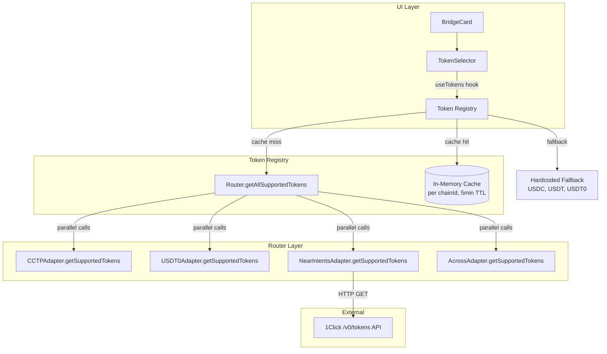
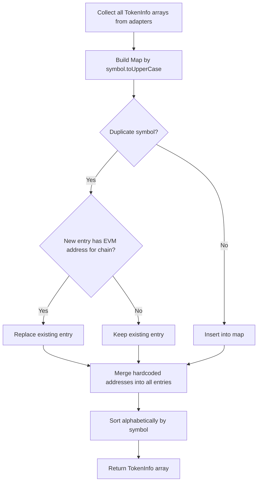

# Design Document: Dynamic Token Discovery

## Overview

Dynamic Token Discovery replaces the hardcoded `TOKENS` record in `src/config/tokens.ts` with a runtime token registry that aggregates token lists from all registered bridge adapters. Each adapter implements a new `getSupportedTokens(chainId)` method on the `IBridgeAdapter` interface. The router queries all adapters in parallel, merges and deduplicates results by symbol, and caches the merged list per chain with a 5-minute TTL. The `TokenSelector` component consumes this registry reactively, showing a loading state during fetches and falling back to the existing hardcoded stablecoin list (USDC, USDT, USDT0) when all API calls fail.

This design preserves backward compatibility: existing adapter methods (`supportsRoute`, `getQuote`, `execute`) are unchanged, and the hardcoded token addresses remain as the fallback source of truth for EVM contract addresses needed by approval transactions.

## Architecture



### Data Flow

1. `TokenSelector` mounts or chain changes → calls `useTokens(chainId)` hook
2. Hook checks `TokenRegistry` cache for the chain
3. Cache hit (< 5 min old) → return cached `TokenInfo[]`
4. Cache miss → `TokenRegistry` calls `Router.getAllSupportedTokens(chainId)`
5. Router calls `getSupportedTokens(chainId)` on all adapters in parallel
6. NEAR Intents fetches from 1Click `/v0/tokens` API; CCTP/USDT0/Across return static lists
7. Router merges results, deduplicates by symbol (case-insensitive), prefers entries with EVM contract addresses
8. Router sorts alphabetically by symbol
9. `TokenRegistry` merges hardcoded EVM addresses into dynamic results, caches, returns
10. If all adapters return empty → return hardcoded fallback tokens for that chain

## Components and Interfaces

### 1. `IBridgeAdapter` Interface Extension (`src/services/types.ts`)

Add one new method to the existing interface:

```typescript
export interface IBridgeAdapter {
  // ... existing methods unchanged ...

  /** Return tokens this adapter supports on the given chain */
  getSupportedTokens(chainId: number): Promise<TokenInfo[]>;
}
```

### 2. `TokenInfo` Type (`src/config/tokens.ts`)

Rename the existing `TokenConfig` to `TokenInfo` (or alias) and ensure it carries all needed fields:

```typescript
export interface TokenInfo {
  symbol: string;
  name: string;
  decimals: number;
  icon: string;
  /** chainId → contract address (0x for EVM, base58 for Tron, mint for Solana) */
  addresses: Record<number, string>;
}
```

This is the existing `TokenConfig` shape — no structural change needed, just re-exported as `TokenInfo` for clarity in the new API surface.

### 3. Adapter Implementations

**CCTPAdapter** (`src/services/cctp.ts`):
- Returns `[USDC TokenInfo]` for chains where `CCTP_DOMAIN_IDS[chainId]` exists
- Returns `[]` otherwise
- Purely static, no network call

**USDT0Adapter** (`src/services/usdt0.ts`):
- Returns `[USDT TokenInfo, USDT0 TokenInfo]` for chains where `USDT0_OFT_CONTRACTS[chainId]` exists
- Returns `[]` otherwise
- Purely static, no network call

**AcrossAdapter** (`src/services/across.ts`):
- Returns `[USDC TokenInfo, USDT TokenInfo]` for EVM chains where `getTokenAddressEVM` returns addresses for both
- Returns `[]` for non-EVM chains or chains without Across token addresses
- Purely static, no network call

**NearIntentsAdapter** (`src/services/nearIntents.ts`):
- Fetches from `NEAR_INTENTS_TOKENS_URL` (`/v0/tokens`)
- Filters by `BLOCKCHAIN_TO_CHAIN_ID` allowlist (existing logic)
- Removes the `ALLOWED_SYMBOLS` filter to include all tokens (ETH, WETH, BTC, ARB, SOL, etc.)
- Maps API response to `TokenInfo[]` with symbol, name, decimals, icon, and address for the requested chain
- Returns `[]` on network failure

### 4. Router Aggregation (`src/services/router.ts`)

New exported function:

```typescript
export async function getAllSupportedTokens(chainId: number): Promise<TokenInfo[]>
```

- Calls `adapter.getSupportedTokens(chainId)` on all registered adapters via `Promise.allSettled`
- Merges results into a `Map<string, TokenInfo>` keyed by `symbol.toUpperCase()`
- When duplicate symbols: prefers the entry that has an EVM contract address for the requested chain (needed for approvals)
- Sorts final array alphabetically by symbol
- If all adapters return empty arrays, returns hardcoded fallback tokens for the chain

### 5. Token Registry Cache (`src/config/tokens.ts`)

New module-level cache and public API:

```typescript
interface CacheEntry {
  tokens: TokenInfo[];
  timestamp: number;
}

const TOKEN_CACHE_TTL = 5 * 60 * 1000; // 5 minutes
const tokenCache = new Map<number, CacheEntry>();

export async function getTokensForChainAsync(chainId: number): Promise<TokenInfo[]>
```

- Checks `tokenCache` for a valid (< 5 min) entry
- On miss, calls `getAllSupportedTokens(chainId)` from the router
- Merges hardcoded EVM addresses into dynamic results (hardcoded addresses are the fallback; dynamic addresses take precedence when present)
- Stores result in cache
- Returns hardcoded fallback if the merged result is empty
- The existing synchronous `getTokensForChain` remains for backward compatibility

### 6. `useTokens` Hook (`src/hooks/useTokens.ts`)

New React hook:

```typescript
export function useTokens(chainId: number): {
  tokens: TokenInfo[];
  isLoading: boolean;
}
```

- On mount and when `chainId` changes, calls `getTokensForChainAsync(chainId)`
- Returns `{ tokens, isLoading }` — initially returns hardcoded tokens while async fetch is in flight
- On success, updates tokens to the dynamic list
- On failure, keeps showing hardcoded tokens (no error shown to user per Req 11.3)

### 7. `TokenSelector` Updates (`src/components/TokenSelector.tsx`)

- Replace `getTokensForChain(chainId)` with `useTokens(chainId)`
- Show a small spinner/skeleton inside the dropdown while `isLoading` is true
- Render all returned tokens (dynamic list may be longer than the current 2-3 stablecoins)

### 8. `BridgeCard` Updates (`src/components/BridgeCard.tsx`)

- Use `useTokens(fromChain)` and `useTokens(toChain)` to get dynamic token lists
- When chain changes and current token isn't in the new list: reset to USDC if available, else first token
- Replace hardcoded `parseUnits(amount, 6)` with `parseUnits(amount, selectedTokenInfo.decimals)` using the `TokenInfo` from the registry
- Output amount formatting: use `toToken`'s decimals instead of hardcoded `1e6`

## Data Models

### TokenInfo

| Field | Type | Description |
|-------|------|-------------|
| `symbol` | `string` | Token ticker (e.g. "USDC", "ETH", "WBTC") |
| `name` | `string` | Human-readable name (e.g. "USD Coin") |
| `decimals` | `number` | Token decimals (6 for USDC/USDT, 18 for ETH, 8 for WBTC) |
| `icon` | `string` | URL to token logo image |
| `addresses` | `Record<number, string>` | Chain ID → contract/mint address |

### CacheEntry

| Field | Type | Description |
|-------|------|-------------|
| `tokens` | `TokenInfo[]` | Cached token list for a chain |
| `timestamp` | `number` | `Date.now()` when cached |

### 1Click API Token Response (from `/v0/tokens`)

```typescript
interface OneClickToken {
  assetId: string;       // e.g. "nep141:eth-0xa0b8...omft.near"
  symbol: string;        // e.g. "USDC"
  name: string;          // e.g. "USD Coin"
  blockchain: string;    // e.g. "eth", "arb", "base"
  decimals: number;      // e.g. 6
  icon?: string;         // URL to token icon
  address?: string;      // native chain address (0x... for EVM)
}
```

### Router Merge Strategy




## Correctness Properties

*A property is a characteristic or behavior that should hold true across all valid executions of a system — essentially, a formal statement about what the system should do. Properties serve as the bridge between human-readable specifications and machine-verifiable correctness guarantees.*

### Property 1: Adapter getSupportedTokens returns valid TokenInfo arrays

*For any* adapter and *for any* chain ID (supported or unsupported), `getSupportedTokens(chainId)` SHALL return a (possibly empty) array where every element has non-empty `symbol`, non-empty `name`, a numeric `decimals` ≥ 0, a string `icon`, and an `addresses` object. The method SHALL never throw.

**Validates: Requirements 1.2, 1.3, 1.4**

### Property 2: NEAR Intents filters to supported chains only

*For any* response from the 1Click tokens API containing tokens across arbitrary blockchain identifiers, the NEAR Intents adapter's `getSupportedTokens` SHALL return only tokens whose `blockchain` field maps to a chain ID in the `BLOCKCHAIN_TO_CHAIN_ID` allowlist. No token with an unmapped blockchain SHALL appear in the result.

**Validates: Requirements 2.2**

### Property 3: NEAR Intents token mapping preserves data

*For any* valid 1Click API token object with fields `symbol`, `name`, `decimals`, `blockchain`, and `address`, the mapped `TokenInfo` SHALL contain the same `symbol`, `name`, and `decimals`, and the `addresses` record SHALL include an entry for the corresponding chain ID with the token's native address.

**Validates: Requirements 2.3**

### Property 4: Router deduplication by symbol

*For any* collection of `TokenInfo` arrays returned by adapters, the merged result from `getAllSupportedTokens` SHALL contain at most one entry per symbol (case-insensitive). That is, for all pairs `(i, j)` where `i ≠ j`, `result[i].symbol.toUpperCase() !== result[j].symbol.toUpperCase()`.

**Validates: Requirements 6.3**

### Property 5: Router prefers entries with EVM contract addresses

*For any* two `TokenInfo` objects with the same symbol (case-insensitive) where one has an EVM contract address (`0x`-prefixed) for the requested chain and the other does not, the merged result SHALL contain the entry with the EVM contract address.

**Validates: Requirements 6.4**

### Property 6: Router sorts alphabetically

*For any* merged token list returned by `getAllSupportedTokens`, the tokens SHALL be sorted such that for all consecutive pairs `(tokens[i], tokens[i+1])`, `tokens[i].symbol.toUpperCase() <= tokens[i+1].symbol.toUpperCase()`.

**Validates: Requirements 6.5**

### Property 7: Cache respects TTL

*For any* chain ID, if `getTokensForChainAsync(chainId)` is called and a cached entry exists with `Date.now() - entry.timestamp < 300_000` (5 minutes), the function SHALL return the cached tokens without invoking any adapter's `getSupportedTokens`.

**Validates: Requirements 7.2**

### Property 8: EVM address merge precedence

*For any* token in the final registry result: if the dynamically discovered `TokenInfo` includes an EVM contract address for a chain, that address SHALL be used; otherwise, if the hardcoded fallback has an EVM address for that chain and symbol, the hardcoded address SHALL be used. The merged `addresses` record SHALL be the union of dynamic and hardcoded addresses, with dynamic taking precedence on conflicts.

**Validates: Requirements 7.4, 10.1, 10.2, 10.3**

### Property 9: Token reset selects USDC or first available

*For any* token list and *for any* currently selected token symbol that is NOT in that list, the reset logic SHALL select "USDC" if a token with symbol "USDC" exists in the list, otherwise it SHALL select the first token in the list (index 0).

**Validates: Requirements 9.3, 9.4**

### Property 10: Decimal-aware amount parsing

*For any* token with `decimals = d` and *for any* valid numeric amount string, the BridgeCard SHALL parse the amount using `parseUnits(amount, d)` rather than a hardcoded decimal value. The parsed bigint SHALL equal `floor(amount * 10^d)`.

**Validates: Requirements 9.6**

## Error Handling

| Scenario | Component | Behavior |
|----------|-----------|----------|
| 1Click API unreachable | NearIntentsAdapter.getSupportedTokens | Returns `[]`; logs warning. Existing `FALLBACK_ASSET_IDS` still used for routing. |
| 1Click API returns malformed JSON | NearIntentsAdapter.getSupportedTokens | Returns `[]`; caught by try/catch. |
| Single adapter throws unexpectedly | Router.getAllSupportedTokens | `Promise.allSettled` catches it; other adapters' results still used. |
| All adapters return empty | Router.getAllSupportedTokens | Returns hardcoded fallback tokens for the chain. |
| Cache entry expired | TokenRegistry | Triggers re-fetch; serves stale data until new data arrives (stale-while-revalidate not required — waits for fresh data). |
| Network timeout on token fetch | useTokens hook | Returns hardcoded tokens (initial state); no error shown to user. |
| Token with unknown decimals | BridgeCard | Uses `decimals` from `TokenInfo`; if somehow missing, defaults to 6 (stablecoin assumption). |
| User selects token then switches chain where token unavailable | BridgeCard | Resets to USDC if available, else first token in list. |
| Dynamic token has no EVM address | TokenRegistry | Merges hardcoded address if available; if neither has an address for the chain, token still appears but approval transactions will be skipped (non-EVM flow). |

## Testing Strategy

### Unit Tests (Example-Based)

- **Adapter-specific tests**: Verify each adapter returns correct tokens for known chains (CCTP → USDC on Ethereum, USDT0 → USDT/USDT0 on Arbitrum, etc.)
- **NEAR Intents API mock**: Verify token mapping from 1Click response format to TokenInfo
- **NEAR Intents error handling**: Verify empty array on fetch failure
- **Router fallback**: Verify hardcoded tokens returned when all adapters return empty
- **Cache hit/miss**: Verify cache returns stored data within TTL, re-fetches after TTL
- **TokenSelector rendering**: Verify loading state, token list rendering, fallback display
- **BridgeCard token reset**: Verify reset to USDC or first token on chain change

### Property-Based Tests

Property-based tests use `fast-check` (the standard PBT library for TypeScript/JavaScript). Each test runs a minimum of 100 iterations.

| Property | Test Description | Tag |
|----------|-----------------|-----|
| Property 1 | Generate random chainIds, call getSupportedTokens on each adapter, verify return shape | Feature: dynamic-token-discovery, Property 1: Adapter getSupportedTokens returns valid TokenInfo arrays |
| Property 2 | Generate random 1Click API responses with mixed blockchain values, verify filtering | Feature: dynamic-token-discovery, Property 2: NEAR Intents filters to supported chains only |
| Property 3 | Generate random valid 1Click token objects, verify mapped TokenInfo preserves fields | Feature: dynamic-token-discovery, Property 3: NEAR Intents token mapping preserves data |
| Property 4 | Generate random TokenInfo arrays with duplicate symbols, verify deduplication | Feature: dynamic-token-discovery, Property 4: Router deduplication by symbol |
| Property 5 | Generate pairs of TokenInfo with same symbol, one with EVM address, verify preference | Feature: dynamic-token-discovery, Property 5: Router prefers entries with EVM contract addresses |
| Property 6 | Generate random TokenInfo arrays, merge, verify alphabetical sort | Feature: dynamic-token-discovery, Property 6: Router sorts alphabetically |
| Property 7 | Generate random chainIds and timestamps, verify cache behavior relative to TTL | Feature: dynamic-token-discovery, Property 7: Cache respects TTL |
| Property 8 | Generate TokenInfo with varying address coverage, merge with hardcoded, verify precedence | Feature: dynamic-token-discovery, Property 8: EVM address merge precedence |
| Property 9 | Generate random token lists and random current selections, verify reset logic | Feature: dynamic-token-discovery, Property 9: Token reset selects USDC or first available |
| Property 10 | Generate random decimals (0-18) and valid amount strings, verify parseUnits uses correct decimals | Feature: dynamic-token-discovery, Property 10: Decimal-aware amount parsing |

### Integration Tests

- **End-to-end token discovery**: With real (or mocked) 1Click API, verify the full pipeline from adapter → router → registry → UI
- **NEAR Intents fallback routing**: Verify that when 1Click API is down, `supportsRoute` still works for tokens in `FALLBACK_ASSET_IDS`
- **Cross-adapter deduplication**: Verify that USDC from CCTP and USDC from Across merge correctly with the right EVM address preserved
